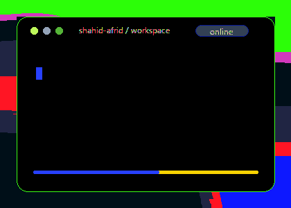

 

  

  

  

  

 

<table width="100%">
  <tr>
    <td width="62%" valign="top">
      <h2>About Me</h2>
      
<strong>B.Tech in Computer Science &amp; Engineering (Data Science)</strong>

      
Rajeev Gandhi Memorial College of Engineering &amp; Technology

      
<strong>UiPath Student Developer Champion (SDC)</strong>

      
I build intelligent software at the intersection of <strong>AI, automation and full stack engineering</strong>.

      
I enjoy transforming ambitious ideas into practical products that solve meaningful problems.

      
<strong>Open source enthusiast · Tech community contributor · Hackathon builder</strong>

    </td>
    <td width="38%" align="center" valign="middle">
      
    </td>
  </tr>
</table>

 

<table width="100%">
  <tr>
    <td width="62%" valign="top">
      <h2>Currently Working On</h2>
      
▹ Building AI-powered full stack applications

      
▹ Developing intelligent automation with UiPath

      
▹ Exploring LLMs and prompt engineering

      
▹ Creating scalable React and API-driven products

      
▹ Deploying applications on Microsoft Azure

      
▹ Preparing for software engineering opportunities

    </td>
    <td width="38%" align="center" valign="middle">
      
    </td>
  </tr>
</table>

 

  

 

## Technology Arsenal

<table width="100%">
  <tr>
    <td width="50%" valign="top">
      <h3>Backend Engineering</h3>
      

      <h3>Frontend Engineering</h3>
      

      <h3>Cloud</h3>
      

    </td>
    <td width="50%" valign="top">
      <h3>Databases</h3>
      

      

      <h3>Developer Tools</h3>
      

    </td>
  </tr>
</table>

### AI & Machine Learning

  
  
  
  
    
  
  
  

### Intelligent Automation

  
  
  
    
  
  

 

## Selected Projects

| Project | What it does | Core technology |
|:--|:--|:--|
| **TutorLive** | Real-time faculty selection platform | ASP.NET Core · SignalR · Azure |
| **Intelligent Answer Script Evaluation** | Evaluates written answers using semantic AI | NLP · Sentence Transformers |
| **Butterfly Image Classification** | Deep learning image classification pipeline | TensorFlow · VGG16 |
| **YOLO Snake Detection** | Detects snakes in real time from visual input | YOLOv8 · Computer Vision |
| **Telugu LLM** | Language-focused generative AI development | LLMs · NLP · Prompt Engineering |
| **UiPath Automation Projects** | Intelligent business process automation | UiPath · Orchestrator · Maestro |

 

## GitHub Intelligence

  <picture>
    <source media="(prefers-color-scheme: dark)" srcset="https://github-readme-stats.vercel.app/api?username=shahid-afrid&show_icons=true&hide_border=true&bg_color=00000000&title_color=38BDF8&text_color=CBD5E1&icon_color=A78BFA&ring_color=38BDF8" />
    
  </picture>
  <picture>
    <source media="(prefers-color-scheme: dark)" srcset="https://github-readme-stats.vercel.app/api/top-langs/?username=shahid-afrid&layout=compact&hide_border=true&bg_color=00000000&title_color=38BDF8&text_color=CBD5E1" />
    
  </picture>

    

  

    

  

 

## Recognition & Direction

<table width="100%">
  <tr>
    <td width="50%" valign="top">
      <h3>Recognition</h3>
      
🏅 UiPath Student Developer Champion

      
🥈 Multiple national-level hackathon finalist

      
🎓 AI Developer Intern — Summer of AI

      
🌍 Open source contributor

    </td>
    <td width="50%" valign="top">
      <h3>Exploring Next</h3>
      
◈ Agentic AI and intelligent agents

      
◈ Retrieval-Augmented Generation

      
◈ AI-powered automation systems

      
◈ Scalable backend architecture

    </td>
  </tr>
</table>

 

### Let's build something meaningful.

<em>Great software is built by curious minds that never stop learning.</em>

  

  

