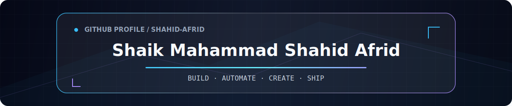
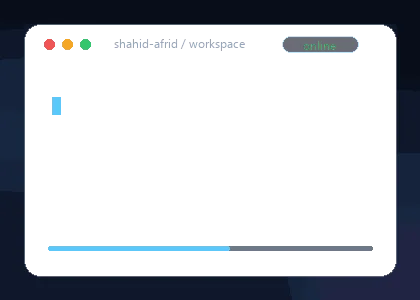
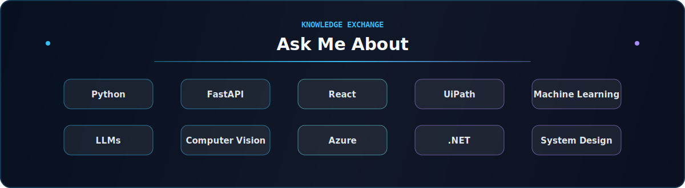

 

 

 

## About Me

**AI Engineer Intern at Oscowl ai** and a final-year Computer Science (Data Science) undergraduate at RGMCET.

- **UiPath Student Developer Champion (SDC)**
- Former **Google Developer Group on Campus Core Lead**
- Building across **AI, intelligent automation and full stack engineering**
- Interested in products that turn complex workflows into simple, scalable systems

As an **aspiring entrepreneur**, I am exploring startup-driven ideas that create measurable real-world impact through technology.

**Proof of work:** production-grade real-time systems, offline AI ranking, civic intelligence platforms and automation workflows.

**Strengths:** Leadership · Public Speaking · Product Thinking

 

## Currently Building

- AI-powered products with practical, explainable intelligence
- UiPath automations for real business workflows
- LLM, RAG and prompt-engineering experiments
- Scalable React and API-driven applications
- Cloud deployments on Microsoft Azure

 

  

## Engineering Toolkit

### Core Engineering

### AI & Data

 

### Automation & Cloud

 

### Tools

## Project Spotlights

### [JanSeva AI](https://github.com/shahid-afrid/janseva-ai)

Converts unstructured citizen complaints into AI-scored priorities, ward heatmaps, recommended actions and decision-ready reports for public representatives. **[Live demo](https://janseva-ai-nu.vercel.app)**

`React 19` · `Vite` · `Tailwind CSS` · `Civic Tech` · `AI for Public Good`

### [SaarLens](https://github.com/shahid-afrid/saarlens-redrob-ranker)

An offline, explainable candidate-ranking engine that prioritizes evidence over keyword stuffing, adds anomaly checks and produces grounded Top-100 recommendations from large candidate datasets.

`Python` · `Streamlit` · `Explainable AI` · `Ranking Systems` · `Data Pipelines`

### TutorLive

A production-grade real-time faculty selection platform used by RGMCET CSE (Data Science), with sub-second availability updates and conflict-safe seat allocation under concurrent usage.

`ASP.NET Core` · `SignalR` · `Azure` · `Real-Time Systems`

### [UiPath SDC Portal](https://github.com/shahid-afrid/uipath-sdc-web)

A dedicated portal for the UiPath Student Developer Champion community and its developer activities.

`TypeScript` · `UiPath` · `Community Platform`

## GitHub Activity

  <picture>
    <source media="(prefers-color-scheme: dark)" srcset="https://github-readme-stats.vercel.app/api?username=shahid-afrid&show_icons=true&hide_border=true&bg_color=00000000&title_color=38BDF8&text_color=CBD5E1&icon_color=A78BFA&ring_color=38BDF8" />
    
  </picture>
  <picture>
    <source media="(prefers-color-scheme: dark)" srcset="https://github-readme-stats.vercel.app/api/top-langs/?username=shahid-afrid&layout=compact&hide_border=true&bg_color=00000000&title_color=38BDF8&text_color=CBD5E1" />
    
  </picture>

   

  

## Recognition

- **UiPath Student Developer Champion**
- **2nd Runner-up - Best Startup Innovation, Ignite 8.0**
- **UiPath Certified Professional - Automation Developer Associate**

## Exploring Next

Agentic AI · Retrieval-Augmented Generation · Intelligent automation · Scalable product architecture

### Let's build something meaningful.

<em>Great software is built by curious minds that never stop learning.</em>

 

 

